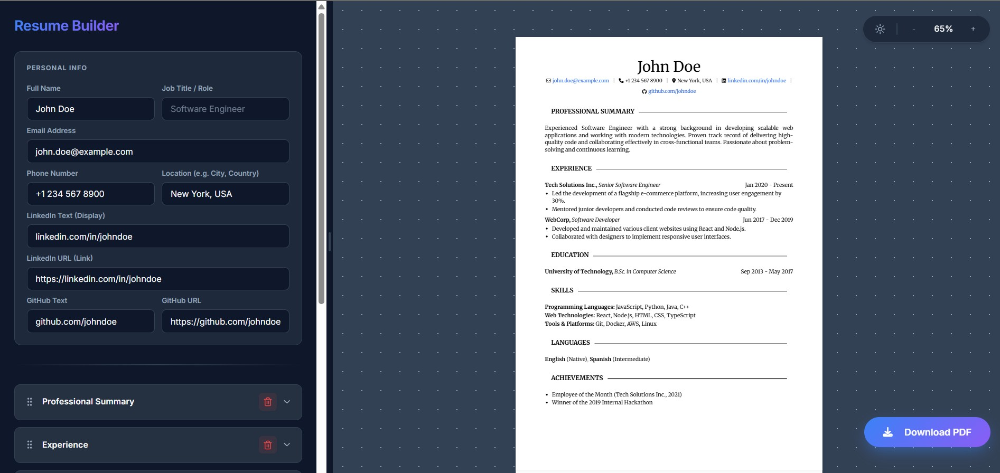

# React Resume Builder

A professional, privacy-focused resume builder built with **React** and **Vite**. Create beautiful, print-ready CVs with a real-time preview and drag-and-drop organization.



## ✨ Key Features

*   **Real-Time Preview**: Instantly see your resume update as you edit.
*   **Drag & Drop Organization**: Easily reorder sections using `@dnd-kit`.
*   **Privacy First**: No database, no accounts. Your data lives in your browser.
*   **A4 Optimized**: Perfectly formatted for standard A4 printing.
*   **Customizable Sections**: Add or remove entries for Experience, Education, Skills, and more.
*   **Dark/Light Mode**: A comfortable UI for any time of day.

## 🛠️ Technology Stack

*   **Framework**: React 18
*   **Build Tool**: Vite
*   **Styling**: Modern CSS Variables & Responsive Layouts
*   **Icons**: Lucide React & FontAwesome
*   **Drag & Drop**: @dnd-kit/core & @dnd-kit/sortable

## 🚀 Getting Started

### 1. Clone the repository
```bash
git clone https://github.com/aliozen0/react-resume-builder.git
cd react-resume-builder
```

### 2. Install dependencies
```bash
npm install
```

### 3. Run the development server
```bash
npm run dev
```

### 4. Build for Production
```bash
npm run build
```

## 📄 License
MIT License
